# Курсовая работа: Предсказание эффективности химических соединений

## Описание задачи

Цель проекта — построить модели машинного обучения для прогнозирования эффективности химических соединений против вируса гриппа.  
Рассматриваются параметры IC50, CC50 и SI, а также их бинарные варианты (по медиане и порогу SI > 8).

## Этапы работы

1. Загрузка и первичная очистка данных (`kurs.xlsx`).
2. EDA-анализ: распределения, выбросы, корреляции.
3. Подготовка признаков и целевых переменных (в `prepare_data.py`).
4. Построение моделей регрессии.
5. Построение моделей классификации.
6. Сравнение качества моделей и финальные выводы.

## Исследовательский анализ данных (EDA)

В рамках предварительного анализа данных были проведены следующие исследования:

- Определено общее количество прзнаков и целевых переменных: 213 признаков и 3 целевых параметра (IC50, CC50, SI).
- Проведён анализ пропущенных значений: обнаружено небольшое количество пропусков в ряде дескрипторов, решено использовать импутацию средними значениями.
- Построены распределения целевых признаков:
  - Распределения IC50, CC50 и SI имеют ярко выраженный правосторонний перекос (не нормальные распределения).
  - Для выравнивания распределений выполнено логарифмирование (`log1p`).
- Проведена визуализация корреляционной матрицы:
  - Обнаружена умеренная корреляция между IC50 и CC50.
  - SI слабо коррелирует с исходными параметрами, что указывает на сложность задачи прогнозирования.
- Построены ящичные диаграммы (boxplots) для выявления выбросов в целевых переменных.
- Проведено первичное исследование некоторых молекулярных признаков (`qed`, `MolWt`, `TPSA`).

### Выводы по EDA:

- Данные содержат выбросы и смещенные распределения, что требует логарифмирования целевых переменных.
- Данные подходят для обучения моделей машинного обучения после минимальной очистки и обработки.
- Наиболее перспективным подходом является построение ансамблевых моделей с учетом трансформации целевых переменных.

---

## Результаты моделей

### Задачи регрессии (предсказание лог(IC50), лог(CC50), лог(SI))

| Задача | Модель             | RMSE   | R²    | Вывод             |
|--------|--------------------|--------|-------|-------------------|
| IC50   | Ridge              | 1.224  | 0.331 | среднее качество  |
|        | Lasso              | 1.351  | 0.185 | слабое качество   |
|        | RandomForest       | 1.151  | 0.409 | **лучший результат** |
|        | GradientBoosting   | 1.186  | 0.372 | хорошо            |
| CC50   | Ridge              | 1.224  | 0.331 | среднее качество  |
|        | Lasso              | 1.351  | 0.185 | слабое качество   |
|        | RandomForest       | 1.143  | 0.416 | **лучший результат** |
|        | GradientBoosting   | 1.180  | 0.378 | хорошо            |
| SI     | Ridge              | 1.516  | 0.064 | слабое качество   |
|        | Lasso              | 1.527  | 0.050 | слабое качество   |
|        | RandomForest       | 1.297  | 0.314 | **лучший результат** |
|        | GradientBoosting   | 1.321  | 0.289 | хорошо            |

---

### Задачи классификации (по медиане и SI > 8)

| Задача             | Модель           | Accuracy | ROC-AUC | Вывод               |
|--------------------|------------------|----------|---------|---------------------|
| IC50 > median      | LogisticRegression | 0.49     | 0.50    | провал              |
|                    | RandomForest       | 0.71     | 0.77    | **лучший результат**|
|                    | GradientBoosting   | 0.69     | 0.78    | хорошо              |
| CC50 > median      | LogisticRegression | 0.49     | 0.50    | провал              |
|                    | RandomForest       | 0.78     | 0.87    | **лучший результат**|
|                    | GradientBoosting   | 0.76     | 0.87    | хорошо              |
| SI > median        | LogisticRegression | 0.51     | 0.50    | провал              |
|                    | RandomForest       | 0.69     | 0.72    | хорошо              |
|                    | GradientBoosting   | 0.66     | 0.71    | приемлемо           |
| SI > 8             | LogisticRegression | 0.49     | 0.50    | провал              |
|                    | RandomForest       | 0.78     | 0.87    | **лучший результат**|
|                    | GradientBoosting   | 0.76     | 0.86    | хорошо              |

---

## Гистограммы распределения признаков

### Распределение IC50, mM
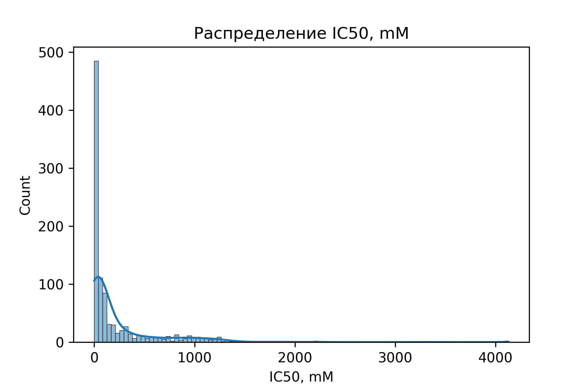

### Распределение CC50, mM
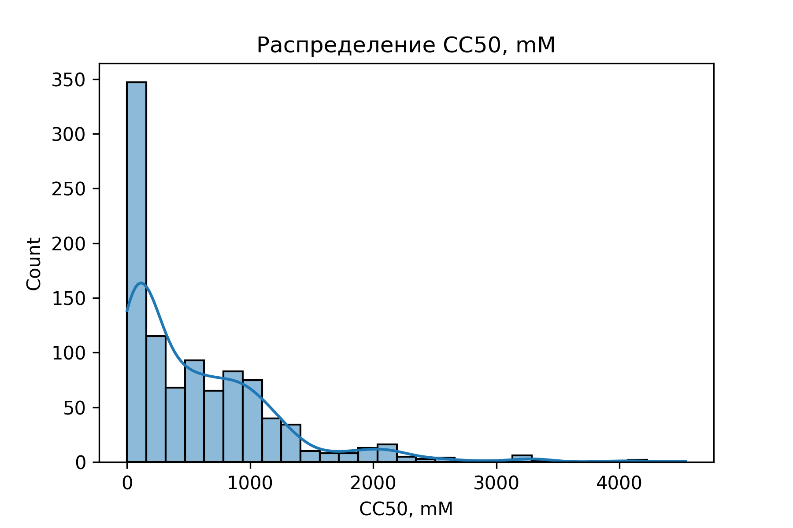

### Распределение SI
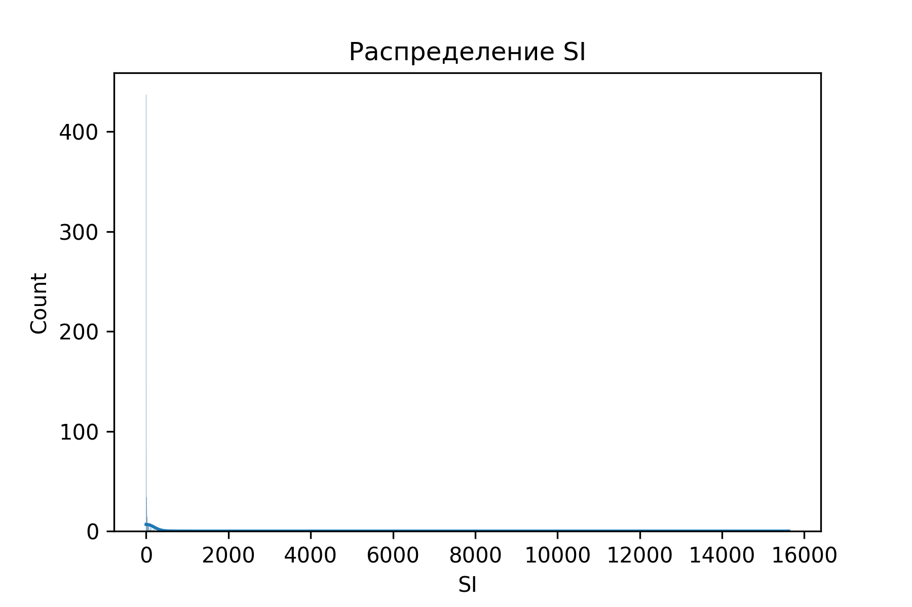

### Распределение MolWt
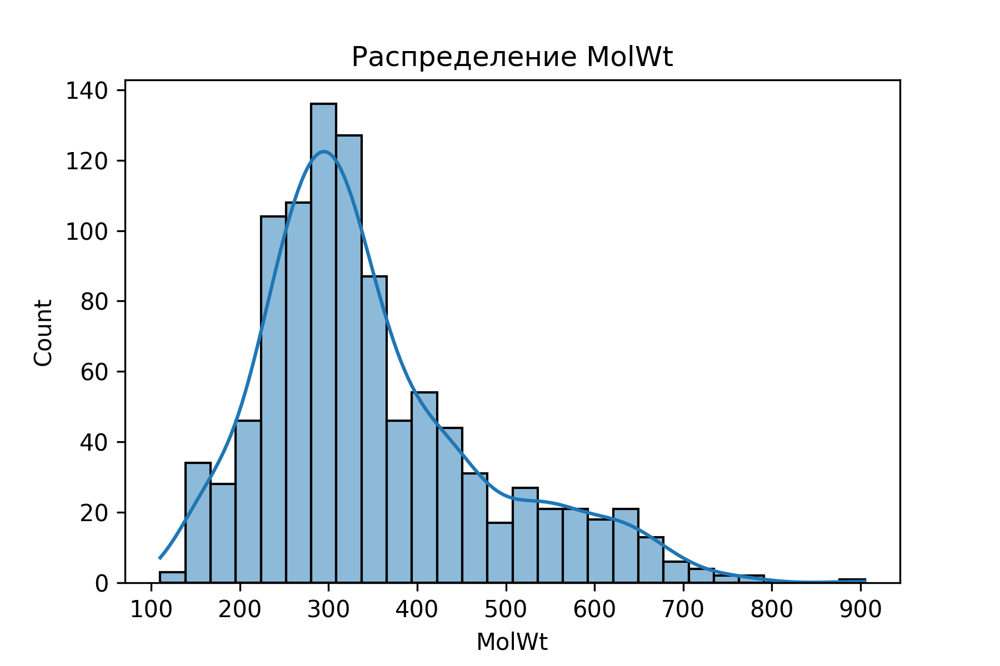

### Распределение qed
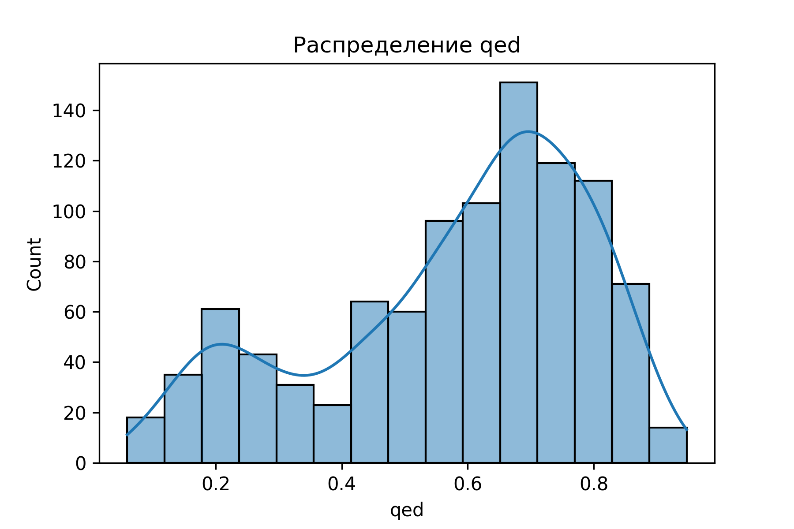

### Распределение TPSA
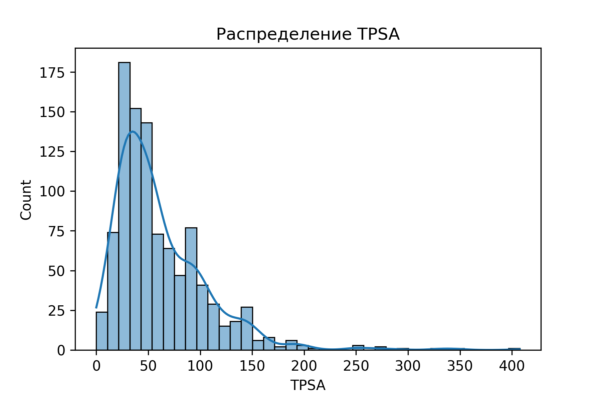

---

## Логарифмированные распределения

### Логарифм IC50, mM
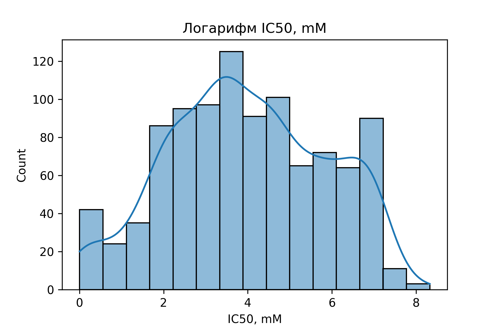

### Логарифм CC50, mM
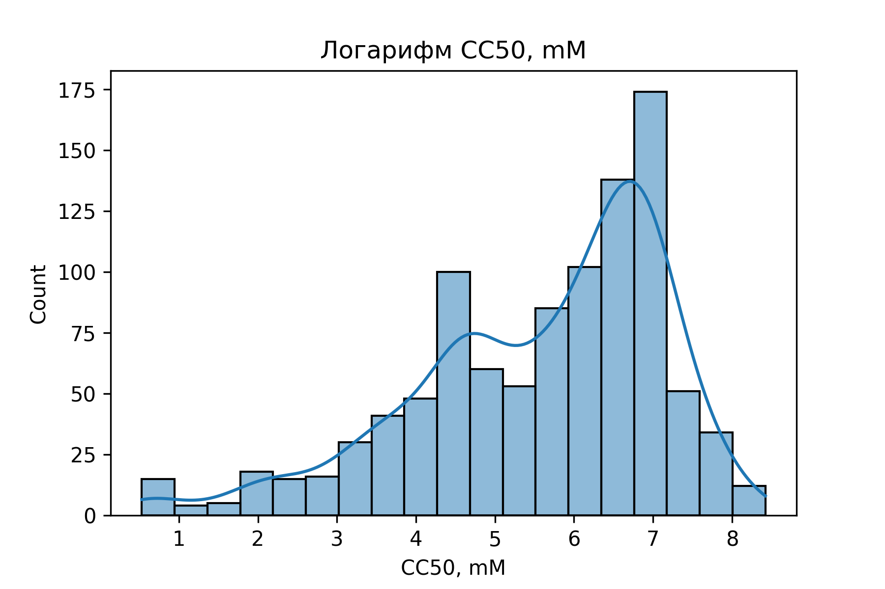

### Логарифм SI
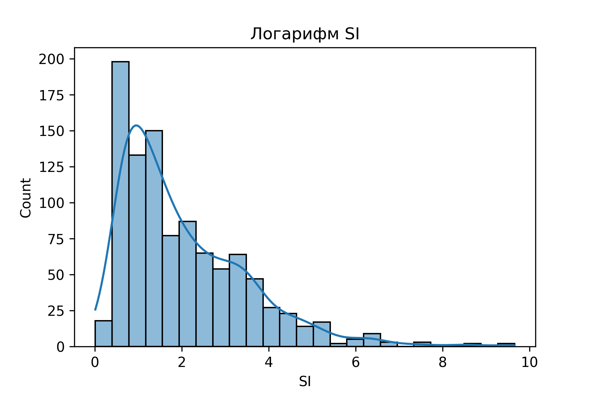

---

## Boxplot для целевых переменных

### Boxplot IC50
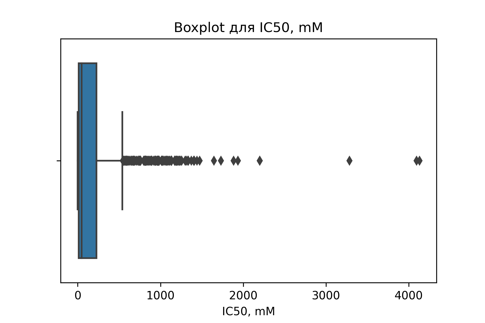

### Boxplot CC50
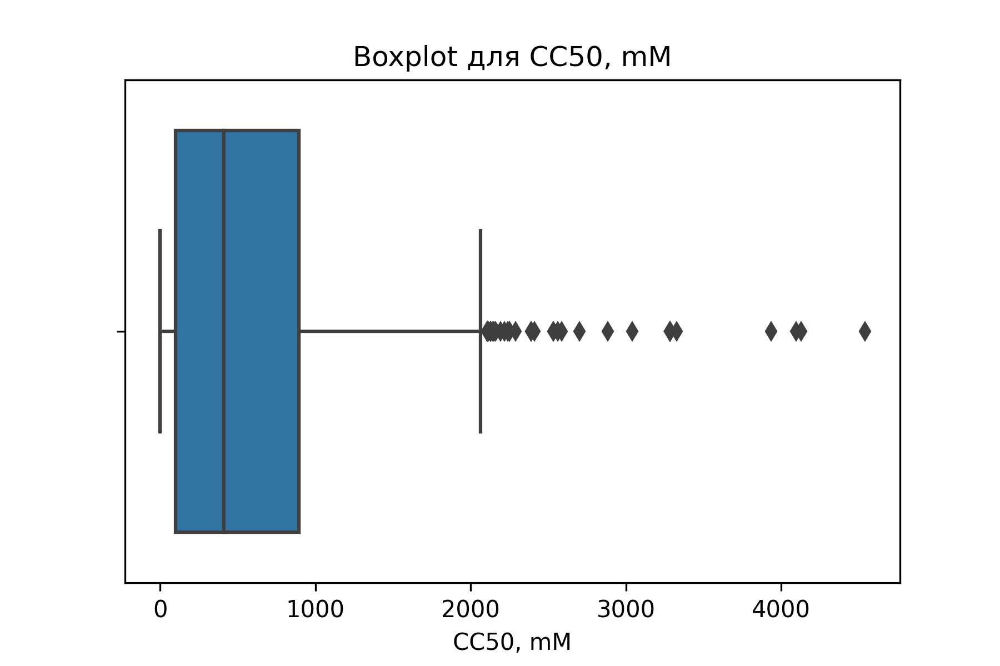

### Boxplot SI
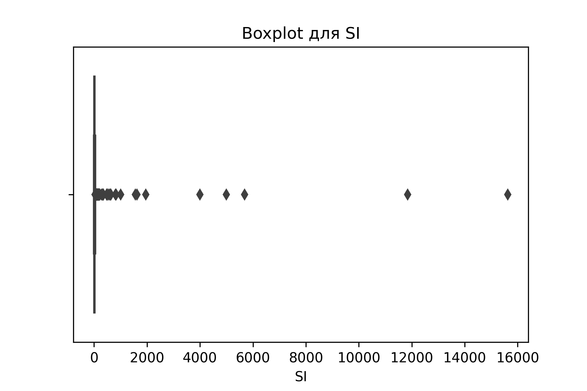

---

## Тепловые карты

### Корреляция IC50, CC50, SI
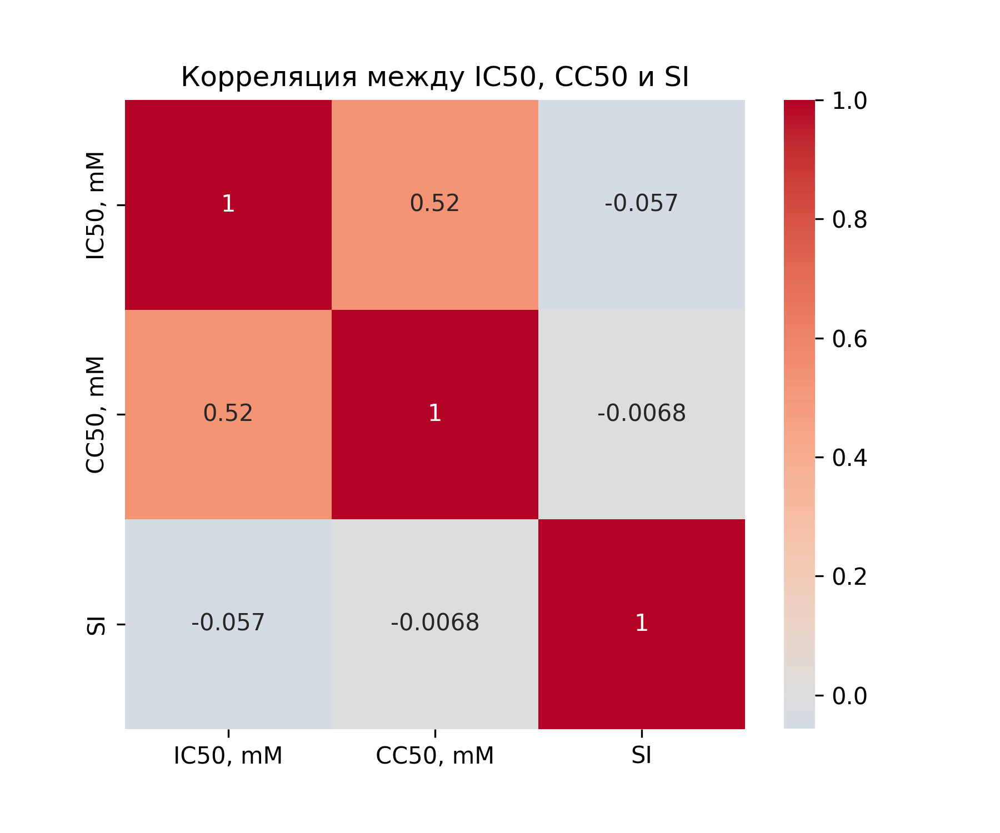

### Полная корреляция
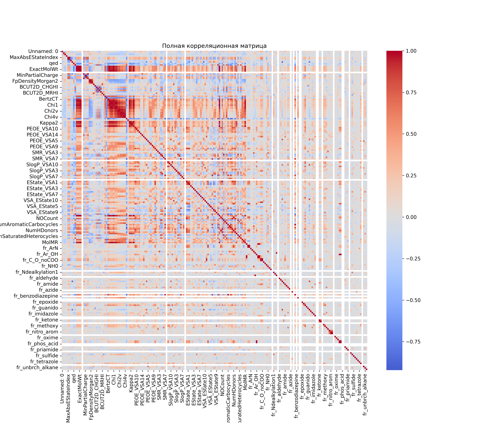

---

## Общие выводы

- **Ансамблевые модели** (RandomForest, GradientBoosting) показали наилучшие результаты во всех задачах.
- **Логистическая регрессия** без масштабирования и настройки параметров работает плохо — accuracy 0.5.
- В задачах регрессии **лучше всех работает RandomForest** (RMSE ≈ 1.1–1.3, R² до 0.41).
- **Данные сильно дисперсные**, требуется логарифмирование и масштабирование.
- Модели можно улучшить через `GridSearchCV`, добавление PCA или отбор признаков.

---

## Рекомендации

- Для практического применения — использовать RandomForest или GradientBoosting.
- Для улучшения точности — масштабировать признаки, использовать нормализацию, повысить интерпретируемость моделей.
- Возможна интеграция с фармацевтами

---

## Использованные инструменты

- Язык: Python 3.9
- Библиотеки: pandas, sklearn, matplotlib, seaborn
- Jupyter Notebooks
- GitHub: [ссылка на репозиторий](https://github.com/sstanna/drug-discovery-ml)
